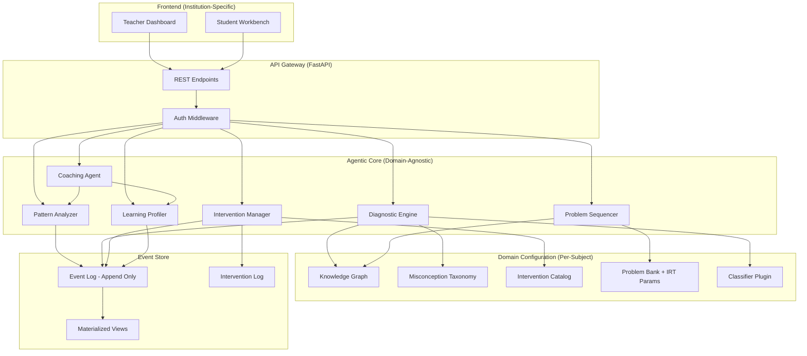
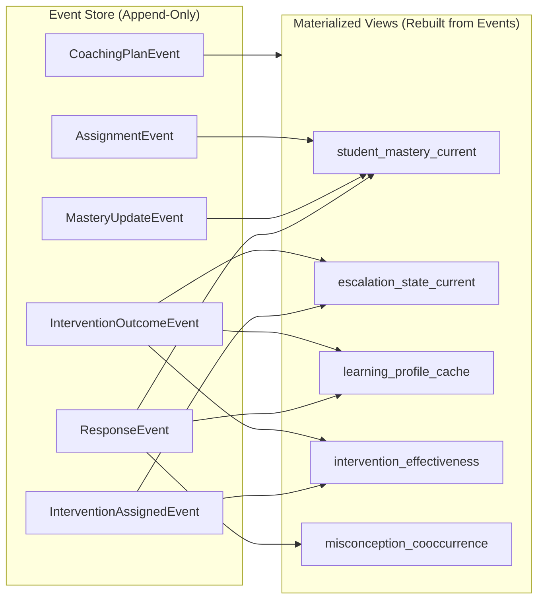
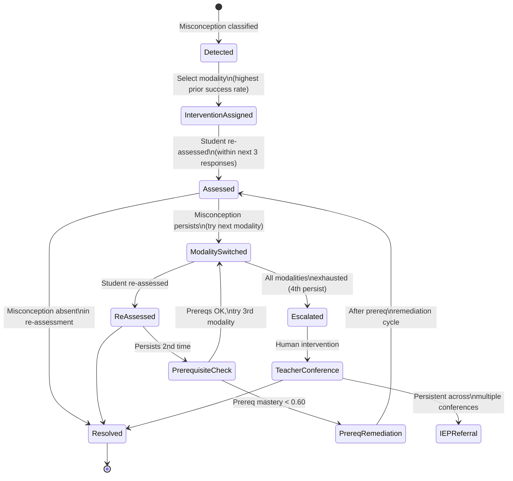
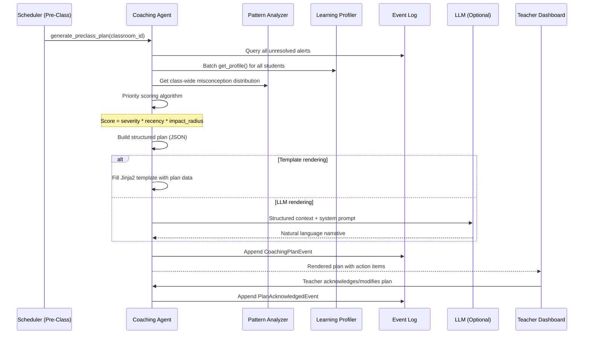
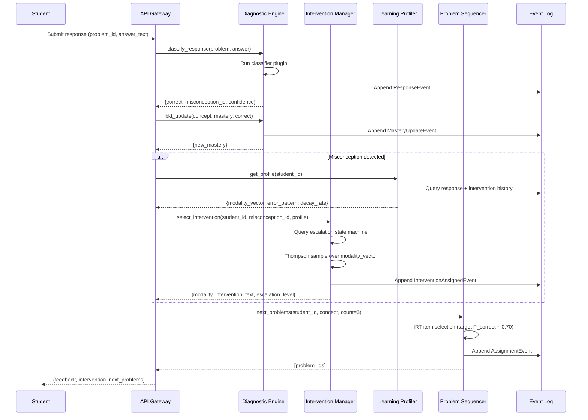
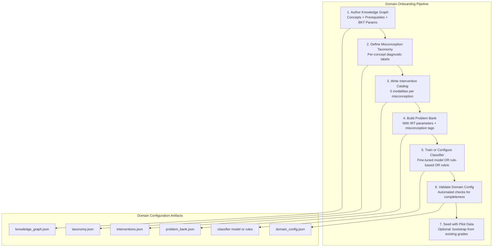
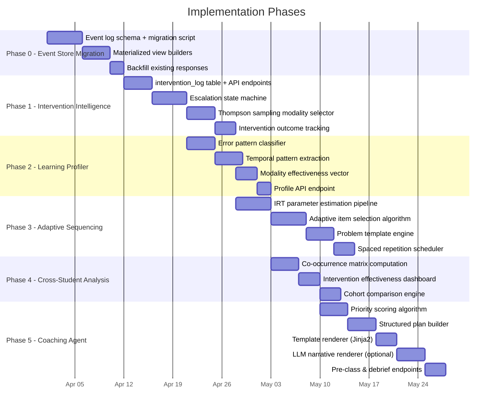

<!-- markdownlint-disable MD013 MD033 -->

## Executive Summary

The current system detects student misconceptions with 91.1% accuracy across 19 types and
displays them on a teacher dashboard. Every intervention is a hardcoded one-liner. Every
problem recommendation selects the three easiest items. The teacher sees the problem but
receives no personalized guidance on how to resolve it.

The gap is detection without prescription.

This document specifies the architecture for evolving the static diagnostic display into a
closed-loop agentic system that recommends interventions, learns which approaches work for
which students, adaptively sequences problems, and coaches teachers with actionable
intelligence. The architecture is designed to be domain-agnostic: the core reasoning engine
is the same whether the subject is algebra, reading comprehension, or music theory. Only
the domain configuration (knowledge graph, misconception taxonomy, intervention catalog,
problem bank, and classifier) changes per subject.

> [!IMPORTANT]
> Every design decision in this document obeys one inviolable constraint: the teacher
> remains in the loop. The system recommends; the teacher decides. No auto-assigning, no
> auto-messaging parents, no decisions without teacher review.

---

## Architecture Overview

The system separates into four architectural layers: a domain-agnostic agentic core, a
per-subject domain configuration, an event-sourced data store, and institution-specific
frontends.



Each agentic core component is a Python module with a defined interface. The domain
configuration is a set of JSON files and an optional classifier model, loaded at startup
and hot-swappable per tenant. The event store is the single source of truth; all mutable
state (mastery levels, escalation states, learning profiles) is materialized from the
append-only event log.

---

## Design Constraints

These constraints apply to every component in every phase. Violating any of them is a
blocking issue in code review.

1. The teacher remains in the loop. The system recommends; the teacher decides. No
   auto-assigning, no auto-messaging parents, no decisions without teacher review.
2. No student-facing AI. Students interact with problems and a text box. Intelligence
   surfaces through the teacher, never directly to the student.
3. Privacy-first, research-enabled. All personally identifiable information (names,
   emails, school identifiers) stays on-premise or in the school's tenant. No PII leaves
   the institution. However, the system collects de-identified learning analytics
   (response patterns, mastery trajectories, intervention outcomes, misconception
   distributions) for research and system improvement. Schools opt in to this data
   sharing through an IRB-approved consent process. De-identified data is stripped of
   all direct and indirect identifiers before export, aggregated to cohort level where
   sample sizes permit, and used solely to improve diagnostic accuracy, intervention
   effectiveness, and the knowledge graph. No third-party advertising or commercial
   analytics. The research data pipeline is documented in the IRB protocol and the
   consent forms name exactly what is collected and why.
4. Graceful degradation. If the LLM is unavailable, fall back to rule-based templates.
   Core diagnostic functions work without an internet connection.
5. Institutional flexibility. The frontend is separate and institution-dependent. The
   agentic backend exposes APIs that any frontend can consume.
6. Event sourcing. Every state change is an appended event. No destructive updates to
   learning data. Mastery, escalation state, and profiles are all materialized views.
7. Domain agnosticism. The core engine never references specific misconception IDs,
   concept names, or subject matter. All domain knowledge lives in configuration files.

---

## Phase 0: Event Store Migration

### Why this comes first

The current schema stores `student_mastery` as a mutable row overwritten on every update.
The `responses` table stores individual events, but mastery is a snapshot with no history.
Every agentic layer depends on temporal reasoning (when did mastery change, how fast does
it decay, what intervention was active when resolution occurred). Without an event log,
none of that is possible.

### Event schema

Every state change in the system becomes an immutable event. The event log is append-only.

```sql
CREATE TABLE events (
    id          INTEGER PRIMARY KEY AUTOINCREMENT,
    event_type  TEXT NOT NULL,
    entity_type TEXT NOT NULL,          -- 'student', 'classroom', 'assignment'
    entity_id   INTEGER NOT NULL,
    payload     TEXT NOT NULL,          -- JSON blob, schema varies by event_type
    created_at  TEXT DEFAULT (datetime('now')),
    created_by  TEXT                    -- 'system', 'teacher:<id>', 'student:<id>'
);

CREATE INDEX idx_events_entity ON events(entity_type, entity_id, created_at);
CREATE INDEX idx_events_type ON events(event_type, created_at);
```

### Event types

| event_type | entity_type | payload schema |
|---|---|---|
| `response.submitted` | student | `{problem_id, student_text, correct, misconception_id, confidence, concept_id, assignment_id, latency_ms}` |
| `mastery.updated` | student | `{concept_id, old_level, new_level, trigger_event_id}` |
| `intervention.assigned` | student | `{misconception_id, modality, intervention_text, escalation_level, selected_by}` |
| `intervention.outcome` | student | `{intervention_event_id, outcome, assessed_at, responses_since}` |
| `assignment.created` | classroom | `{title, problem_ids, assigned_by}` |
| `assignment.completed` | student | `{assignment_id, score, misconceptions_detected}` |
| `coaching.plan_generated` | classroom | `{plan_type, structured_plan_json, rendered_text}` |
| `coaching.plan_acknowledged` | classroom | `{plan_event_id, teacher_id, modifications}` |
| `profile.computed` | student | `{profile_json, computed_at}` |
| `alert.created` | student | `{alert_type, severity, message, recommendation}` |
| `alert.resolved` | student | `{alert_event_id, resolved_by}` |

### Event sourcing data model



### Materialized views

These are regular tables rebuilt from the event log. They can be dropped and recreated at
any time without data loss. They exist purely for query performance.

```sql
-- Current mastery per student per concept (replaces the mutable student_mastery table)
CREATE TABLE student_mastery_current (
    student_id  INTEGER NOT NULL,
    concept_id  TEXT NOT NULL,
    mastery_level REAL NOT NULL,
    attempts    INTEGER NOT NULL,
    last_event_id INTEGER NOT NULL,
    updated_at  TEXT NOT NULL,
    PRIMARY KEY (student_id, concept_id)
);

-- Current escalation state per student per misconception
CREATE TABLE escalation_state_current (
    student_id      INTEGER NOT NULL,
    misconception_id TEXT NOT NULL,
    state           TEXT NOT NULL,       -- detected, intervention_assigned, modality_switched,
                                         -- prerequisite_check, prereq_remediation, escalated, resolved
    modalities_tried TEXT NOT NULL,       -- JSON array: ["visual", "concrete"]
    attempt_count   INTEGER NOT NULL,
    last_event_id   INTEGER NOT NULL,
    updated_at      TEXT NOT NULL,
    PRIMARY KEY (student_id, misconception_id)
);

-- Cached learning profile (recomputed periodically)
CREATE TABLE learning_profile_cache (
    student_id          INTEGER PRIMARY KEY,
    error_pattern       TEXT NOT NULL,       -- careless, systematic, foundational_gap, transfer_failure
    avg_latency_ms      REAL,
    mastery_decay_rate  REAL,
    learning_velocity   REAL,
    modality_vector     TEXT NOT NULL,       -- JSON: {"visual": 0.68, "concrete": 0.74, ...}
    transfer_success    REAL,
    computed_at         TEXT NOT NULL
);

-- Intervention effectiveness (aggregated across students)
CREATE TABLE intervention_effectiveness (
    misconception_id TEXT NOT NULL,
    modality        TEXT NOT NULL,
    attempts        INTEGER NOT NULL,
    resolutions     INTEGER NOT NULL,
    resolution_rate REAL NOT NULL,
    updated_at      TEXT NOT NULL,
    PRIMARY KEY (misconception_id, modality)
);
```

### Migration script

The migration must preserve all existing data. Write a script that:

1. Creates the `events` table
2. Reads every row from `responses` and inserts a corresponding `response.submitted` event
3. Reads every row from `student_mastery` and inserts a `mastery.updated` event
4. Reads every row from `alerts` and inserts an `alert.created` event
5. Creates all materialized view tables and populates them from the new events
6. Renames old tables to `_legacy_*` (do not drop them until the migration is verified)
7. Updates all API endpoints to read from materialized views and write to the event log

### Implementation task for this phase

Create `api/events.py` with:

```python
from __future__ import annotations
import json
from datetime import datetime, timezone
from api.database import get_db


def append_event(
    event_type: str,
    entity_type: str,
    entity_id: int,
    payload: dict,
    created_by: str = "system",
) -> int:
    """Append an immutable event and return its ID."""
    with get_db() as conn:
        cursor = conn.execute(
            """INSERT INTO events (event_type, entity_type, entity_id, payload, created_by)
               VALUES (?, ?, ?, ?, ?)""",
            (event_type, entity_type, entity_id, json.dumps(payload), created_by),
        )
        return cursor.lastrowid


def get_events(
    entity_type: str,
    entity_id: int,
    event_type: str | None = None,
    since: str | None = None,
) -> list[dict]:
    """Query events for an entity, optionally filtered by type and time."""
    with get_db() as conn:
        query = "SELECT * FROM events WHERE entity_type = ? AND entity_id = ?"
        params: list = [entity_type, entity_id]
        if event_type:
            query += " AND event_type = ?"
            params.append(event_type)
        if since:
            query += " AND created_at >= ?"
            params.append(since)
        query += " ORDER BY created_at ASC"
        rows = conn.execute(query, params).fetchall()
        return [
            {**dict(row), "payload": json.loads(row["payload"])}
            for row in rows
        ]
```

Create `api/migrate_to_events.py` as a standalone migration script that performs steps
1-6 above. Run it once, verify, then update the API layer.

> [!TIP]
> You can verify the migration is correct by asserting that the materialized
> `student_mastery_current` view matches the old `student_mastery` table row-for-row
> before cutting over.

### Files to create or modify

| File | Action | Description |
|---|---|---|
| `api/events.py` | Create | Event log append/query functions |
| `api/migrate_to_events.py` | Create | One-time migration script |
| `api/database.py` | Modify | Add events table and materialized views to `init_db()` |

---

## Phase 1: Intervention Intelligence

### Problem statement

Every student with a given misconception receives the same static string. The system
ignores whether the student has already seen this intervention and it failed, whether
prerequisite mastery is the real blocker, how many times this misconception has recurred,
and what intervention approaches have worked for similar students.

### Intervention taxonomy

The system supports five modalities per misconception. These are not hardcoded in Python
(as they are today in `api/engine.py`). They live in a domain configuration file.

| Modality | Description | When to use |
|---|---|---|
| visual | Diagrams, area models, number lines, graphs | First attempt; students with spatial reasoning strength |
| concrete | Numerical substitution, physical manipulatives, worked numeric examples | After visual fails; students who respond to numbers over symbols |
| pattern | Side-by-side worked examples, "what's the pattern?" activities | Inductive learners |
| verbal | Analogy, metaphor, narrative explanation | Students who respond to story and language |
| peer | Pair with a student who resolved this misconception | Social learners; when a resolved peer exists in the class |

### Domain configuration file: interventions.json

Each domain provides an intervention catalog. The algebra instantiation looks like this:

```json
{
  "domain": "algebra_fundamentals",
  "interventions": {
    "dist_first_term_only": {
      "visual": {
        "text": "Area model: draw a rectangle with width = factor and length = (a + b).",
        "materials": ["area_model_worksheet.pdf"],
        "estimated_minutes": 5
      },
      "concrete": {
        "text": "Numerical substitution: try 2(3+4) by distributing and by computing parentheses first. Compare.",
        "materials": [],
        "estimated_minutes": 3
      },
      "pattern": {
        "text": "Show 3 worked examples side-by-side. Ask: what operation was applied to every term?",
        "materials": ["worked_examples_dist.pdf"],
        "estimated_minutes": 5
      },
      "verbal": {
        "text": "The factor is like a delivery person visiting every house on the street, not just the first one.",
        "materials": [],
        "estimated_minutes": 2
      },
      "peer": {
        "text": "Pair with a student who resolved this misconception for collaborative practice.",
        "materials": [],
        "estimated_minutes": 10,
        "requires_resolved_peer": true
      }
    }
  }
}
```

### Escalation state machine

The escalation logic is not a numbered list. It is a per-student, per-misconception state
machine with explicit states and transitions.



### State transitions reference

| Current state | Event | Condition | Next state |
|---|---|---|---|
| (none) | `response.submitted` with misconception | First detection | `detected` |
| `detected` | System selects modality | Always | `intervention_assigned` |
| `intervention_assigned` | 3 responses assessed | Misconception absent | `resolved` |
| `intervention_assigned` | 3 responses assessed | Misconception present | `modality_switched` |
| `modality_switched` | 3 responses assessed | Misconception absent | `resolved` |
| `modality_switched` | 3 responses assessed | Misconception present, attempt < 3 | `prerequisite_check` |
| `prerequisite_check` | Prereq mastery check | Any prereq < 0.60 | `prereq_remediation` |
| `prerequisite_check` | Prereq mastery check | All prereqs >= 0.60 | `modality_switched` |
| `prereq_remediation` | Prereq mastery >= 0.60 | Re-enter main flow | `intervention_assigned` |
| `modality_switched` | 3 responses assessed | Misconception present, all modalities tried | `escalated` |
| `escalated` | Teacher acknowledges | Always | `teacher_conference` |
| `teacher_conference` | Teacher marks resolved | Resolution confirmed | `resolved` |
| `teacher_conference` | Multiple conferences fail | Persistent issue | `iep_referral` |

### State machine implementation

Create `api/intervention_manager.py`:

```python
from __future__ import annotations
from dataclasses import dataclass
from enum import Enum


class EscalationState(str, Enum):
    DETECTED = "detected"
    INTERVENTION_ASSIGNED = "intervention_assigned"
    MODALITY_SWITCHED = "modality_switched"
    PREREQUISITE_CHECK = "prerequisite_check"
    PREREQ_REMEDIATION = "prereq_remediation"
    ESCALATED = "escalated"
    TEACHER_CONFERENCE = "teacher_conference"
    IEP_REFERRAL = "iep_referral"
    RESOLVED = "resolved"


MODALITY_ORDER = ["visual", "concrete", "pattern", "verbal", "peer"]


@dataclass
class InterventionContext:
    student_id: int
    misconception_id: str
    current_state: EscalationState
    modalities_tried: list[str]
    attempt_count: int
    prerequisite_mastery: dict[str, float]
    modality_vector: dict[str, float]       # from learning profile
    class_effectiveness: dict[str, float]   # from cross-student analysis


def select_intervention(ctx: InterventionContext) -> tuple[str, EscalationState]:
    """Return (selected_modality, new_state) based on escalation logic.

    Uses Thompson sampling over the modality vector to balance exploitation
    (pick the historically best modality) with exploration (occasionally try
    others to improve estimates).
    """
    available = [m for m in MODALITY_ORDER if m not in ctx.modalities_tried]

    if not available:
        return ("teacher_conference", EscalationState.ESCALATED)

    if ctx.attempt_count >= 2:
        # Check prerequisites before trying more modalities
        low_prereqs = {
            c: m for c, m in ctx.prerequisite_mastery.items() if m < 0.60
        }
        if low_prereqs:
            return ("prereq_remediation", EscalationState.PREREQ_REMEDIATION)

    # Thompson sampling: draw from Beta(successes+1, failures+1) per modality
    # For available modalities, use class-wide effectiveness as prior
    import random
    scores = {}
    for modality in available:
        alpha = ctx.class_effectiveness.get(modality, 0.5) * 10 + 1
        beta_param = (1 - ctx.class_effectiveness.get(modality, 0.5)) * 10 + 1
        # Blend with student-specific vector if available
        student_weight = ctx.modality_vector.get(modality, 0.5)
        alpha += student_weight * 5
        beta_param += (1 - student_weight) * 5
        scores[modality] = random.betavariate(alpha, beta_param)

    selected = max(scores, key=scores.get)
    new_state = (
        EscalationState.INTERVENTION_ASSIGNED
        if ctx.attempt_count == 0
        else EscalationState.MODALITY_SWITCHED
    )
    return (selected, new_state)
```

### Thompson sampling explained

Why not pick the modality with the highest success rate?

If the system always exploits (picks the best-known option), it never learns whether other
modalities might work better. Consider: the "visual" modality was tried first for 22
students and resolved 68% of the time. The "pattern" modality was tried only 3 times
(because the system always picks "visual" first) and happened to resolve 2/3 = 67%. The
system would keep picking "visual" forever, never discovering that "pattern" might actually
resolve 81% if it had more data.

Thompson sampling solves this by drawing a random sample from each modality's success
distribution. Modalities with less data have wider distributions, so they occasionally
"win" the draw and get selected, generating new data. Over time, the system converges on
the true best modality while maintaining enough exploration to detect shifts.

The math:

* For each modality $m$, maintain counts: $s_m$ (successes) and $f_m$ (failures)
* Draw $\theta_m \sim \text{Beta}(s_m + 1, f_m + 1)$
* Select $m^* = \arg\max_m \theta_m$

The `+1` terms are the prior (uniform Beta(1,1)). In practice, we initialize with the
class-wide effectiveness rates as an informative prior, so a brand-new student benefits
from class-wide data immediately.

### Outcome tracking

An intervention's outcome is assessed by checking whether the misconception appears in the
student's next 3 responses on that concept.

```python
def assess_intervention_outcome(
    student_id: int,
    misconception_id: str,
    intervention_event_id: int,
) -> str:
    """Check the last 3 responses since intervention for misconception recurrence.

    Returns: 'resolved', 'persisted', or 'not_assessed' (fewer than 3 responses).
    """
    events = get_events(
        entity_type="student",
        entity_id=student_id,
        event_type="response.submitted",
    )
    # Find responses after the intervention event
    intervention_event = get_event_by_id(intervention_event_id)
    post_responses = [
        e for e in events
        if e["created_at"] > intervention_event["created_at"]
        and e["payload"]["concept_id"] == get_concept_for_misconception(misconception_id)
    ]

    if len(post_responses) < 3:
        return "not_assessed"

    recent_three = post_responses[:3]
    recurred = any(
        r["payload"].get("misconception_id") == misconception_id
        for r in recent_three
    )
    return "persisted" if recurred else "resolved"
```

### API endpoints for Phase 1

| Method | Path | Description |
|---|---|---|
| `GET` | `/api/students/{id}/interventions` | Current and historical interventions for a student |
| `GET` | `/api/students/{id}/interventions/active` | Currently assigned, unresolved interventions |
| `POST` | `/api/students/{id}/interventions/assign` | Trigger the escalation state machine and assign an intervention |
| `PATCH` | `/api/interventions/{id}/outcome` | Record an outcome (resolved/persisted) |
| `GET` | `/api/classrooms/{id}/intervention-effectiveness` | Class-wide modality effectiveness rates |

### Files to create or modify

| File | Action | Description |
|---|---|---|
| `api/intervention_manager.py` | Create | Escalation state machine + Thompson sampling |
| `data/interventions.json` | Create | Domain-specific intervention catalog |
| `api/main.py` | Modify | Add Phase 1 API endpoints |
| `api/database.py` | Modify | Add escalation_state_current view to `init_db()` |
| `api/engine.py` | Modify | Remove hardcoded `HINTS`/`INTERVENTIONS` dicts; load from `interventions.json` |

### Validation Experiment 04: Thompson Sampling vs Greedy Modality Selection

**Question.** Does Thompson sampling over intervention modalities produce higher
misconception resolution rates than a greedy policy (always pick the modality with
the highest historical success rate)?

**Design.** Monte Carlo simulation, 1 000 simulated students x 50 interactions each,
comparing three policies:

| Policy | Logic |
|---|---|
| Thompson | Draw from Beta(successes+1, failures+1) per modality, pick max |
| Greedy | Always pick the modality with the highest observed success rate |
| Uniform random | Pick a modality uniformly at random |

**Data generation.** Each simulated student has a latent modality preference vector
(5 elements, one per modality) drawn from Dirichlet(1,1,1,1,1). When the system
assigns modality $m$, resolution probability = `preference_vector[m]`. This creates
ground-truth heterogeneity: some students genuinely respond better to visual,
others to concrete.

**Primary metrics.**

| Metric | Definition |
|---|---|
| Cumulative resolution rate | Fraction of interventions that resolve the misconception, measured at intervals of 10, 20, 30, 40, 50 interactions |
| Regret | Difference between the policy's resolution rate and the oracle policy (always picks the student's true best modality) |
| Convergence speed | Number of interactions until the policy's running best-modality estimate matches the student's true best |

**Scalability axis.** Vary number of modalities from 3 to 10 to test whether Thompson
sampling degrades gracefully when the action space grows (relevant for domains with
more intervention types).

**Expected outcome.** Thompson should match or beat greedy after ~15 interactions
(exploration payoff) and should significantly beat uniform. Regret should decrease
as $O(\sqrt{n})$.

**Artifacts.**
- `experiments/04_thompson_vs_greedy/artifacts/results.json`
- `experiments/04_thompson_vs_greedy/artifacts/resolution_curves.png`
- `experiments/04_thompson_vs_greedy/artifacts/regret_curves.png`
- `experiments/04_thompson_vs_greedy/artifacts/scalability.png`

**Reproducibility.** `python experiments/04_thompson_vs_greedy/run.py` (seed=42).

### Validation Experiment 06: Escalation State Machine Convergence

**Question.** Under the Phase 1 escalation state machine, what fraction of
misconceptions reach each terminal state (resolved, teacher_conference, iep_referral),
and how sensitive is this to the misconception resolution probability?

**Design.** Absorbing Markov chain analysis + Monte Carlo validation.

Step 1 (analytical): model the escalation state machine as an absorbing Markov chain.
The transient states are detected, intervention_assigned, modality_switched,
prerequisite_check, and prereq_remediation. The absorbing states are resolved,
teacher_conference, and iep_referral. Compute the absorption probabilities and
expected number of steps analytically from the fundamental matrix
$N = (I - Q)^{-1}$.

Step 2 (simulation): run 10 000 misconception episodes through the state machine
with configurable resolution probability per modality attempt. Validate that
empirical absorption fractions match the analytical result.

**Sensitivity sweep.** Vary per-attempt resolution probability from 0.10 to 0.90
in steps of 0.05. For each value, compute:

| Metric | Definition |
|---|---|
| P(resolved) | Fraction reaching the resolved state |
| P(teacher_conference) | Fraction reaching teacher conference |
| E[steps to absorption] | Expected interactions before a terminal state |
| E[modalities tried] | Expected number of distinct modalities used |

**Design choice axis.** Vary the number of modality attempts allowed before
escalation (currently 4) from 2 to 8. Plot P(resolved) vs attempts-allowed
for different resolution probabilities.

**Expected outcome.** At resolution probability 0.50 (the v2 RCT setting),
>90% of misconceptions should resolve before teacher escalation. At 0.20,
the system should escalate frequently, validating that the safety net works.

**Artifacts.**
- `experiments/06_escalation_convergence/artifacts/results.json`
- `experiments/06_escalation_convergence/artifacts/absorption_probabilities.png`
- `experiments/06_escalation_convergence/artifacts/expected_steps.png`
- `experiments/06_escalation_convergence/artifacts/attempts_vs_resolution.png`

**Reproducibility.** `python experiments/06_escalation_convergence/run.py` (seed=42).

---

## Phase 2: Learning Profile Detection

### Problem statement

Every student is treated as interchangeable. The system has no model of individual learning
patterns, only per-concept mastery scores. Two students with identical mastery of 0.55 on
"distributive property" may need completely different interventions: one has a systematic
misconception that needs targeted remediation, the other has a foundational gap in integer
signs that cascades forward.

### Error pattern classification

Classify each student into one of four error patterns based on their response history. This
is a deterministic classification, not a machine learning model.

| Pattern | Detection rule | Implication |
|---|---|---|
| Careless errors | Mastery >= 0.70 AND error rate < 20% AND errors show no consistent misconception | Attention/focus strategies, not re-teaching |
| Systematic misconception | Same misconception_id appears in >= 3 responses on a concept | Targeted conceptual intervention via escalation state machine |
| Foundational gap | Errors on concept X AND prerequisite concept Y has mastery < 0.60 | Stop current topic; remediate prerequisite first |
| Transfer failure | Mastery >= 0.80 on easy/medium problems AND < 0.50 on hard problems for same concept | Mixed-context practice, not more of the same |

### Temporal pattern extraction

Three signals extracted from timestamped response data:

Response latency (already captured as `latency_ms` in the event payload):

* Fast-and-wrong (< 10s): likely guessing or careless. Intervention: slow-down prompts.
* Slow-and-wrong (> 60s): likely struggling. Intervention: scaffolding and worked examples.
* Slow-and-right (> 60s): learning is happening but effortful. Monitor, do not intervene.

Mastery decay rate:

$$\text{decay\_rate} = \frac{\Delta \text{mastery}}{\Delta \text{days}} = \frac{m_{t_2} - m_{t_1}}{t_2 - t_1}$$

Compute over all pairs of consecutive mastery snapshots for a concept, then average. High
decay (> 0.05/day) indicates the student needs spaced repetition with shorter intervals.

Learning velocity: number of responses required to move from mastery 0.35 to 0.85 on a
concept. This normalizes for concept difficulty by comparing within-concept.

$$v_c = \frac{1}{n_c} \quad \text{where } n_c = \text{responses from } m=0.35 \text{ to } m=0.85$$

Higher velocity means fewer problems needed. Students with low velocity need more
scaffolding, not just more volume.

### Modality effectiveness vector

A 5-element vector computed from the student's intervention history:

$$\vec{e} = [e_{\text{visual}}, e_{\text{concrete}}, e_{\text{pattern}}, e_{\text{verbal}}, e_{\text{peer}}]$$

Where each element is:

$$e_m = \frac{\text{resolutions}_m + 1}{\text{attempts}_m + 2}$$

The `+1/+2` is Laplace smoothing (equivalent to a Beta(1,1) prior), so modalities with
zero data default to 0.50 rather than undefined. This vector feeds into the Thompson
sampling in Phase 1.

### Implementation

Create `api/learning_profiler.py`:

```python
from __future__ import annotations
from dataclasses import dataclass
from datetime import datetime, timezone

from api.events import get_events


MODALITY_ORDER = ["visual", "concrete", "pattern", "verbal", "peer"]


@dataclass
class LearningProfile:
    student_id: int
    error_pattern: str          # careless, systematic, foundational_gap, transfer_failure
    avg_latency_ms: float
    mastery_decay_rate: float   # avg mastery loss per day across concepts
    learning_velocity: float    # avg responses to reach mastery
    modality_vector: dict[str, float]  # {visual: 0.68, concrete: 0.74, ...}
    transfer_success_rate: float
    computed_at: str


def compute_learning_profile(student_id: int) -> LearningProfile:
    """Derive learning characteristics from event history.

    Query the event log for all response.submitted and intervention.outcome
    events for this student. Compute each metric from the raw data.
    Cache the result in learning_profile_cache.
    """
    responses = get_events("student", student_id, "response.submitted")
    interventions = get_events("student", student_id, "intervention.outcome")

    return LearningProfile(
        student_id=student_id,
        error_pattern=_classify_error_pattern(responses),
        avg_latency_ms=_compute_avg_latency(responses),
        mastery_decay_rate=_compute_decay_rate(student_id),
        learning_velocity=_compute_velocity(student_id),
        modality_vector=_compute_modality_vector(interventions),
        transfer_success_rate=_compute_transfer_rate(responses),
        computed_at=datetime.now(timezone.utc).isoformat(),
    )


def _classify_error_pattern(responses: list[dict]) -> str:
    """Classify the student's dominant error pattern.

    Logic:
    1. Group responses by concept_id
    2. For each concept, check prerequisite mastery -> foundational_gap
    3. Check if same misconception_id repeats 3+ times -> systematic
    4. Check if mastery is high but hard problems fail -> transfer_failure
    5. Otherwise -> careless
    Return the most frequent pattern across concepts.
    """
    ...


def _compute_avg_latency(responses: list[dict]) -> float:
    """Mean response latency in milliseconds."""
    latencies = [r["payload"].get("latency_ms", 0) for r in responses]
    return sum(latencies) / len(latencies) if latencies else 0.0


def _compute_decay_rate(student_id: int) -> float:
    """Average mastery loss per day across all concepts.

    Query mastery.updated events, compute (old_level - new_level) / days_between
    for consecutive pairs, return the mean.
    """
    ...


def _compute_velocity(student_id: int) -> float:
    """Average number of responses to go from mastery 0.35 to 0.85 per concept.

    Query mastery.updated events per concept, find the response count between
    the first event with level >= 0.35 and the first event with level >= 0.85.
    """
    ...


def _compute_modality_vector(interventions: list[dict]) -> dict[str, float]:
    """Compute Laplace-smoothed effectiveness per modality."""
    counts = {m: {"success": 0, "total": 0} for m in MODALITY_ORDER}
    for iv in interventions:
        modality = iv["payload"].get("modality")
        if modality not in counts:
            continue
        counts[modality]["total"] += 1
        if iv["payload"].get("outcome") == "resolved":
            counts[modality]["success"] += 1
    return {
        m: (c["success"] + 1) / (c["total"] + 2)
        for m, c in counts.items()
    }


def _compute_transfer_rate(responses: list[dict]) -> float:
    """Fraction of hard-difficulty problems answered correctly among
    concepts where the student has mastery >= 0.80 on easy/medium."""
    ...
```

### API endpoints for Phase 2

| Method | Path | Description |
|---|---|---|
| `GET` | `/api/students/{id}/profile` | Current learning profile (cached or recomputed) |
| `GET` | `/api/classrooms/{id}/profiles` | All student profiles in a classroom |

### Files to create or modify

| File | Action | Description |
|---|---|---|
| `api/learning_profiler.py` | Create | Profile computation and caching |
| `api/main.py` | Modify | Add profile endpoints |

---

## Phase 3: Adaptive Problem Sequencing

### Problem statement

The problem bank has 28 problems. The `recommend_problems()` function picks the 3 easiest
for a concept. No awareness of problems already seen, optimal difficulty for current
mastery, spaced repetition, or misconception-targeted selection.

### IRT-based item selection

Replace categorical difficulty labels (easy/medium/hard) with Item Response Theory
parameters on every problem. Use the Rasch model (1-parameter logistic, 1PL) to start:

$$P(\text{correct} \mid \theta, b) = \frac{1}{1 + e^{-(\theta - b)}}$$

Where:

* $\theta$ = student ability (derived from current mastery: $\theta = \ln\frac{m}{1-m}$)
* $b$ = item difficulty (estimated from response data or set manually)

The optimal learning zone targets items where $P(\text{correct}) \approx 0.65 - 0.80$.
Solving for $b$:

$$b_{\text{target}} = \theta - \ln\frac{P_{\text{target}}}{1 - P_{\text{target}}}$$

For $P_{\text{target}} = 0.70$ and a student with mastery 0.55 ($\theta = 0.20$):

$$b_{\text{target}} = 0.20 - \ln\frac{0.70}{0.30} = 0.20 - 0.85 = -0.65$$

So the system selects problems with difficulty $b$ closest to $-0.65$.

### Problem bank schema extension

Add IRT parameters and misconception diagnostic tags to each problem:

```json
{
  "problem_id": "dist_01",
  "concept": "distributive_property",
  "problem_text": "Expand: 3(x + 4)",
  "correct_answer": "3x + 12",
  "difficulty": "easy",
  "irt_b": -1.2,
  "irt_discrimination": 1.0,
  "diagnostic_for": ["dist_first_term_only", "dist_drop_parens"],
  "template_id": "dist_expand_simple",
  "template_params": {"factor": 3, "var": "x", "constant": 4}
}
```

The `diagnostic_for` field indicates which misconceptions this problem is designed to
surface. When the system needs to verify whether `dist_first_term_only` has resolved, it
selects a problem tagged with that misconception.

The `template_id` and `template_params` fields enable parameterized generation: the system
can create novel instances of the same structural problem with different coefficients, so
students never see the exact same problem twice.

### IRT parameter estimation

For new problems without response data, set initial $b$ values manually:

| Category | Initial $b$ |
|---|---|
| easy | -1.5 |
| medium | 0.0 |
| hard | 1.5 |

After 30+ responses, re-estimate $b$ using maximum likelihood:

```python
import math
from scipy.optimize import minimize_scalar


def estimate_difficulty(
    responses: list[dict],
    student_abilities: dict[int, float],
) -> float:
    """Estimate item difficulty b from observed responses using MLE.

    responses: list of {student_id, correct} dicts
    student_abilities: {student_id: theta} mapping
    """
    def neg_log_likelihood(b: float) -> float:
        nll = 0.0
        for r in responses:
            theta = student_abilities[r["student_id"]]
            p = 1.0 / (1.0 + math.exp(-(theta - b)))
            p = max(min(p, 0.999), 0.001)  # clamp for numerical stability
            if r["correct"]:
                nll -= math.log(p)
            else:
                nll -= math.log(1 - p)
        return nll

    result = minimize_scalar(
        neg_log_likelihood, bounds=(-4.0, 4.0), method="bounded"
    )
    return round(result.x, 3)
```

### Adaptive sequencing algorithm

```python
import math


def generate_assignment(
    student_id: int,
    target_concepts: list[str],
    count: int = 5,
) -> list[str]:
    """Generate a personalized problem set using IRT-based selection."""
    profile = get_cached_profile(student_id)
    seen = get_seen_problem_ids(student_id)
    mastery = get_current_mastery(student_id)
    problems: list[str] = []

    # Step 1: Prerequisite remediation
    # If any prerequisite has mastery < 0.60, include one easy remediation problem
    for concept in target_concepts:
        for prereq in get_prerequisites(concept):
            if mastery.get(prereq, 0) < 0.60:
                problems.extend(
                    select_by_irt(prereq, student_id, seen, target_p=0.80, n=1)
                )

    # Step 2: Target concept problems at optimal difficulty
    # Select items where P(correct) ~ 0.70 for the student's current ability
    for concept in target_concepts:
        # If there's an active unresolved misconception, prefer diagnostic problems
        active_misconceptions = get_active_misconceptions(student_id, concept)
        if active_misconceptions:
            problems.extend(
                select_diagnostic(concept, active_misconceptions[0], seen, n=1)
            )
        problems.extend(
            select_by_irt(concept, student_id, seen, target_p=0.70, n=1)
        )

    # Step 3: Spaced repetition
    # Include one problem from a previously mastered concept not seen in 7+ days
    stale = get_stale_mastered_concepts(student_id, days=7)
    if stale:
        problems.extend(
            select_by_irt(stale[0], student_id, seen, target_p=0.80, n=1)
        )

    return problems[:count]


def select_by_irt(
    concept: str,
    student_id: int,
    seen: set[str],
    target_p: float,
    n: int,
) -> list[str]:
    """Select n unseen problems closest to the target P(correct) for this student."""
    mastery = get_current_mastery_for_concept(student_id, concept)
    theta = math.log(max(mastery, 0.01) / max(1 - mastery, 0.01))
    target_b = theta - math.log(target_p / (1 - target_p))

    candidates = [
        p for p in get_problems_for_concept(concept)
        if p["problem_id"] not in seen
    ]
    # Sort by distance from target difficulty
    candidates.sort(key=lambda p: abs(p.get("irt_b", 0.0) - target_b))
    return [p["problem_id"] for p in candidates[:n]]


def select_diagnostic(
    concept: str,
    misconception_id: str,
    seen: set[str],
    n: int,
) -> list[str]:
    """Select unseen problems tagged as diagnostic for a specific misconception."""
    candidates = [
        p for p in get_problems_for_concept(concept)
        if p["problem_id"] not in seen
        and misconception_id in p.get("diagnostic_for", [])
    ]
    return [p["problem_id"] for p in candidates[:n]]
```

### Problem template engine

To prevent item exhaustion (28 problems are not enough for adaptive sequencing), create
parameterized templates:

```python
import random


TEMPLATES = {
    "dist_expand_simple": {
        "pattern": "{factor}({var} + {constant})",
        "answer_pattern": "{factor}{var} + {product}",
        "concept": "distributive_property",
        "diagnostic_for": ["dist_first_term_only", "dist_drop_parens"],
        "irt_b_base": -1.2,
        "param_ranges": {
            "factor": (2, 9),
            "constant": (1, 12),
        },
    },
}


def generate_from_template(template_id: str) -> dict:
    """Generate a novel problem instance from a template."""
    tmpl = TEMPLATES[template_id]
    factor = random.randint(*tmpl["param_ranges"]["factor"])
    constant = random.randint(*tmpl["param_ranges"]["constant"])
    product = factor * constant
    var = random.choice(["x", "y", "n", "a"])

    return {
        "problem_id": f"{template_id}_{factor}_{var}_{constant}",
        "concept": tmpl["concept"],
        "problem_text": f"Expand: {factor}({var} + {constant})",
        "correct_answer": f"{factor}{var} + {product}",
        "irt_b": tmpl["irt_b_base"],
        "diagnostic_for": tmpl["diagnostic_for"],
        "generated": True,
    }
```

### API endpoints for Phase 3

| Method | Path | Description |
|---|---|---|
| `POST` | `/api/students/{id}/generate-assignment` | Generate a personalized problem set |
| `GET` | `/api/problems/{id}/irt` | Get IRT parameters for a problem |
| `POST` | `/api/problems/estimate-difficulty` | Re-estimate IRT params from accumulated data |

### Files to create or modify

| File | Action | Description |
|---|---|---|
| `api/problem_sequencer.py` | Create | IRT selection, spaced repetition, template engine |
| `data/problem_bank.json` | Modify | Add `irt_b`, `diagnostic_for`, `template_id` fields to every problem |
| `api/engine.py` | Modify | Replace `recommend_problems()` with call to `problem_sequencer` |
| `api/main.py` | Modify | Add personalized assignment generation endpoint |

### Validation Experiment 05: IRT-Based vs Categorical Problem Selection

**Question.** Does IRT-based problem selection (target P(correct) ~ 0.70) produce
higher learning gains than the current categorical approach (pick the 3 easiest
problems for a concept)?

**Design.** Simulated RCT, 500 students per condition, 40 interactions each.
Reuses the existing `SimulatedStudent` and `generate_students` infrastructure
with the held-out test evaluation from Experiment 02.

| Condition | Problem selection logic |
|---|---|
| IRT-targeted | Select the problem whose IRT difficulty $b$ minimizes $\|P(\text{correct}) - 0.70\|$ given the student's current $\theta$ |
| Categorical-easy | Always pick the easiest unseen problem (current system behavior) |
| Categorical-hard | Always pick the hardest unseen problem (adversarial baseline) |
| Random | Pick a random unseen problem |

**IRT parameter assignment.** Assign $b$ values to the 28 existing problems
using the initial calibration table (easy=-1.5, medium=0.0, hard=1.5).
Student ability $\theta = \ln(m / (1-m))$ from current BKT mastery.

**Primary metrics.**

| Metric | Definition |
|---|---|
| Post-test score gain | Held-out test score (post) minus (pre), same decoupled assessment as Experiment 02 |
| Desirable difficulty hit rate | Fraction of assigned problems where the student's actual accuracy falls in [0.55, 0.85] |
| Concepts mastered | Number of concepts reaching mastery threshold |
| Efficiency | Test score gain per interaction |

**Scalability axis.** Vary problem bank size from 15 to 100 (using the template
engine to generate additional problems) and measure whether IRT's advantage
grows with a richer item pool.

**Expected outcome.** IRT-targeted should beat categorical-easy by d ~ 0.15-0.30.
Categorical-hard should perform worst (frustration). The advantage of IRT should
grow with larger problem banks because it has more items near the optimal
difficulty to choose from.

**Artifacts.**
- `experiments/05_irt_vs_categorical/artifacts/results.json`
- `experiments/05_irt_vs_categorical/artifacts/learning_curves.png`
- `experiments/05_irt_vs_categorical/artifacts/difficulty_targeting.png`
- `experiments/05_irt_vs_categorical/artifacts/bank_size_scaling.png`

**Reproducibility.** `python experiments/05_irt_vs_categorical/run.py` (seed=42).

---

## Phase 4: Cross-Student Pattern Analysis

### Problem statement

The system analyzes students individually. It does not learn from the class as a whole.
This means the system cannot discover that two misconceptions always co-occur, that one
intervention modality works better for third period than second period, or that a
prerequisite relationship exists that the hand-authored knowledge graph missed.

### Misconception co-occurrence matrix

Build a matrix $C$ where $C_{ij}$ = the fraction of students who exhibit misconception $j$
among those who exhibit misconception $i$:

$$C_{ij} = \frac{|\{s : s \text{ has } m_i \text{ AND } m_j\}|}{|\{s : s \text{ has } m_i\}|}$$

High values of $C_{ij}$ where $m_i$ is a prerequisite-level misconception suggest that
resolving $m_i$ first may automatically resolve $m_j$. This is how the system discovers
prerequisite relationships the knowledge graph missed.

```python
from collections import Counter


def compute_cooccurrence_matrix(classroom_id: int) -> dict[str, dict[str, float]]:
    """Compute misconception co-occurrence rates across all students in a classroom."""
    students = get_students_in_classroom(classroom_id)
    # For each student, get the set of misconceptions ever detected
    student_misconceptions: dict[int, set[str]] = {}
    for student in students:
        events = get_events("student", student["id"], "response.submitted")
        student_misconceptions[student["id"]] = {
            e["payload"]["misconception_id"]
            for e in events
            if e["payload"].get("misconception_id")
        }

    # Compute C[i][j] = P(j | i)
    all_misconceptions: set[str] = set()
    for ms in student_misconceptions.values():
        all_misconceptions.update(ms)

    matrix: dict[str, dict[str, float]] = {}
    for mi in all_misconceptions:
        matrix[mi] = {}
        students_with_mi = [
            s for s, ms in student_misconceptions.items() if mi in ms
        ]
        for mj in all_misconceptions:
            if mi == mj:
                matrix[mi][mj] = 1.0
                continue
            if not students_with_mi:
                matrix[mi][mj] = 0.0
                continue
            co_count = sum(
                1 for s in students_with_mi
                if mj in student_misconceptions[s]
            )
            matrix[mi][mj] = round(co_count / len(students_with_mi), 3)
    return matrix
```

### Intervention effectiveness tracking (class-wide)

Aggregate intervention outcomes across all students in a classroom:

```text
dist_first_term_only:
  visual:    68% resolution (n=22, 95% CI: [48%, 84%])
  concrete:  74% resolution (n=19, 95% CI: [51%, 90%])
  pattern:   81% resolution (n=16, 95% CI: [54%, 96%])
  verbal:    55% resolution (n=11, 95% CI: [23%, 83%])
  peer:      [insufficient data, n=3]
```

Confidence intervals matter. With small samples, the difference between 68% and 81% is
not statistically significant. The system reports confidence intervals alongside point
estimates so teachers (and the Thompson sampling algorithm) make calibrated decisions.

Use the Wilson score interval for binomial proportions:

$$\hat{p} \pm \frac{z \sqrt{\hat{p}(1-\hat{p})/n + z^2/(4n^2)}}{1 + z^2/n}$$

Where $z = 1.96$ for 95% confidence.

```python
import math


def wilson_interval(successes: int, total: int, z: float = 1.96) -> tuple[float, float]:
    """Compute Wilson score confidence interval for a binomial proportion."""
    if total == 0:
        return (0.0, 1.0)
    p_hat = successes / total
    denominator = 1 + z**2 / total
    center = (p_hat + z**2 / (2 * total)) / denominator
    spread = z * math.sqrt(p_hat * (1 - p_hat) / total + z**2 / (4 * total**2)) / denominator
    return (max(0.0, round(center - spread, 3)), min(1.0, round(center + spread, 3)))
```

### Cohort comparison

Compare intervention effectiveness between classrooms:

```python
def compare_cohorts(
    classroom_ids: list[int],
    misconception_id: str,
) -> list[dict]:
    """Compare resolution rates across classrooms for a given misconception."""
    results = []
    for cid in classroom_ids:
        effectiveness = get_intervention_effectiveness(cid, misconception_id)
        results.append({
            "classroom_id": cid,
            "by_modality": effectiveness,
            "avg_resolution_days": compute_avg_resolution_time(cid, misconception_id),
        })
    return results
```

### Discovered prerequisite feedback

When $C_{ij} > 0.80$ and $m_i$ belongs to a prerequisite concept of $m_j$'s concept, the
system proposes adding a hard prerequisite edge to the knowledge graph. The teacher reviews
and approves. This is how the knowledge graph evolves from data, not just from the initial
hand-authored configuration.

### API endpoints for Phase 4

| Method | Path | Description |
|---|---|---|
| `GET` | `/api/classrooms/{id}/misconception-cooccurrence` | Co-occurrence matrix for a classroom |
| `GET` | `/api/classrooms/{id}/intervention-effectiveness` | Aggregated effectiveness with confidence intervals |
| `GET` | `/api/analytics/cohort-comparison` | Cross-classroom comparison for a misconception |
| `GET` | `/api/analytics/discovered-prerequisites` | Proposed knowledge graph edges from data |

### Files to create or modify

| File | Action | Description |
|---|---|---|
| `api/pattern_analyzer.py` | Create | Co-occurrence matrix, effectiveness aggregation, cohort comparison |
| `api/main.py` | Modify | Add analytics endpoints |

---

## Phase 5: Teacher Coaching Agent

### Problem statement

The dashboard shows data. Teachers must interpret data and decide what to do. This is the
cognitive load the system should reduce. The coaching agent is the highest-impact feature,
but it depends on having real data from Phases 1-4 to generate meaningful recommendations.

### Architecture: planning agent, not generation agent

The coaching agent has two distinct layers:

1. A deterministic planning layer that queries diagnostic state, scores priorities, and
   builds a structured action plan (JSON). This layer is testable, auditable, and works
   without an LLM.
2. A rendering layer that converts the structured plan into natural language (via templates
   or LLM). This layer is swappable: a mobile app might consume the JSON directly without
   any narrative.



### Priority scoring algorithm

Each potential action item receives a priority score:

$$\text{score} = w_s \cdot S + w_r \cdot R + w_i \cdot I + w_t \cdot T$$

Where:

* $S$ = severity (0-1): how critical is the issue? An escalated misconception scores 1.0;
  a near-mastery push scores 0.3.
* $R$ = recency (0-1): $e^{-\lambda \Delta t}$ where $\Delta t$ = days since last
  relevant event and $\lambda = 0.1$.
* $I$ = impact radius (0-1): fraction of the class affected by this issue.
* $T$ = teacher effort (inverted, 0-1): lower effort actions score higher. A whole-class
  warm-up (effort=0.2) scores higher than a one-on-one conference (effort=0.8).
* Weights: $w_s = 0.4$, $w_r = 0.2$, $w_i = 0.2$, $w_t = 0.2$.

```python
import math
from datetime import datetime


def compute_priority_score(
    severity: float,
    days_since_event: float,
    class_fraction_affected: float,
    teacher_effort: float,
    weights: tuple[float, ...] = (0.4, 0.2, 0.2, 0.2),
) -> float:
    """Compute a priority score for a potential coaching action item.

    severity: 0-1 (1 = most critical)
    days_since_event: float >= 0
    class_fraction_affected: 0-1
    teacher_effort: 0-1 (1 = most effort, inverted in scoring)
    """
    w_s, w_r, w_i, w_t = weights
    recency = math.exp(-0.1 * days_since_event)
    effort_inverted = 1.0 - teacher_effort
    return round(
        w_s * severity + w_r * recency + w_i * class_fraction_affected + w_t * effort_inverted,
        3,
    )
```

### Structured plan schema

```json
{
  "classroom_id": 1,
  "plan_type": "pre_class",
  "generated_at": "2026-03-29T07:30:00Z",
  "action_items": [
    {
      "priority": 1,
      "score": 0.92,
      "action_type": "pull_out_group",
      "students": [
        {"id": 12, "name": "James", "misconception": "sign_neg_times_neg", "escalation_level": 3}
      ],
      "recommendation": "Use the number line activity from last Tuesday.",
      "evidence": "This intervention resolved sign_neg_times_neg for 4/5 students who tried it.",
      "estimated_minutes": 5
    },
    {
      "priority": 2,
      "score": 0.71,
      "action_type": "whole_class_warmup",
      "students": [
        {"id": 5, "name": "Sofia", "mastery": 0.82, "concept": "order_of_operations"},
        {"id": 8, "name": "Liam", "mastery": 0.78, "concept": "order_of_operations"}
      ],
      "recommendation": "Assign problems ooo_3 and ooo_4 as a warm-up.",
      "evidence": "6 students are within 0.03-0.07 of the mastery threshold.",
      "estimated_minutes": 3
    }
  ]
}
```

### Three coaching outputs

The planning agent generates three types of output. Each starts from the same structured
plan; only the rendering differs.

Pre-class action plan (generated before class starts, or the night before):

```text
Today's Plan for Period 2 - Algebra I

Priority 1: Pull-out group (5 min)
  James, Sofia, and Liam need integer sign remediation.
  Use the number line activity from last Tuesday (it resolved
  this misconception for 4/5 students who tried it).

Priority 2: Whole-class warm-up (3 min)
  6 students are close to mastering Order of Operations (0.78-0.84).
  Assign problems ooo_3 and ooo_4 as a warm-up to push them over threshold.

Priority 3: Monitor Aiden
  Aiden dropped from 0.72 to 0.58 on Distributive Property
  since last session. Check if yesterday's absence caused regression.
```

Post-assignment debrief (generated after students complete an assignment):

```text
Assignment "Diagnostic Check #2" Results

New findings:
  - 3 new students showing dist_first_term_only (Maria, Chen, David)
  - The area model worksheet resolved this for 4/5 previously affected students
  - Recommendation: reuse it for the new group

Concerning:
  - James got 0/2 on sign problems despite remediation last week
  - His misconception (sign_neg_times_neg) has persisted 6 sessions
  - Escalation: recommend one-on-one conference with concrete manipulatives

Positive:
  - 8 students crossed the 0.85 mastery threshold on Order of Operations
  - Class readiness for Distributive Property improved from 54% to 72%
```

Parent conference narrative (generated on demand for a specific student):

```text
Student Summary: Maria Rodriguez
Period 2 - Algebra I | Generated March 29, 2026

Maria has strong foundational skills: she mastered integer operations
(92%) and order of operations (88%) within the first two weeks.

She is currently working on the distributive property, where she
consistently applies the multiplication to only the first term inside
parentheses. For example, she writes 2(x+3) = 2x+3 instead of 2x+6.
This is the most common error pattern we see at this stage.

We have tried visual scaffolding (area model diagrams) which has not
yet resolved the issue after 4 attempts. Next step: concrete numerical
examples where she can verify by substitution, which has been effective
for similar students.

Maria's work ethic is strong: she completes assignments promptly and
her non-conceptual errors are rare. The distributive property gap is
the single blocker preventing her from moving to combining like terms.
```

### Rendering strategy

| Output type | Frequency | Rendering method | Latency budget | Cost |
|---|---|---|---|---|
| Pre-class plan | 1x/day/classroom | Jinja2 template | Pre-computed overnight | $0 |
| Post-assignment debrief | 1x/assignment | Jinja2 template | < 2s (synchronous) | $0 |
| Parent narrative | On demand | LLM with structured context | < 10s | ~$0.01 |

For LLM rendering, the system constructs a structured context document and passes it with
a constraining system prompt. The teacher reviews the output before sharing; the system
never auto-sends anything to parents.

```python
PARENT_NARRATIVE_SYSTEM_PROMPT = """You are a teaching assistant writing a parent
conference summary. Write in plain language at an 8th-grade reading level. Be specific
about what the student can do, what they're working on, and what comes next. Never use
jargon. Never speculate about causes outside the data. Do not mention AI, algorithms,
or system internals. Keep the tone warm, factual, and encouraging."""


def render_parent_narrative(student_id: int, llm_client) -> str:
    """Generate a parent conference narrative using LLM."""
    profile = get_cached_profile(student_id)
    mastery = get_all_mastery(student_id)
    interventions = get_intervention_history(student_id)
    alerts = get_active_alerts(student_id)

    context = build_structured_context(profile, mastery, interventions, alerts)

    response = llm_client.chat(
        system=PARENT_NARRATIVE_SYSTEM_PROMPT,
        user=f"Write a parent conference summary for this student:\n\n{context}",
        max_tokens=500,
        temperature=0.3,
    )
    return response.text
```

### API endpoints for Phase 5

| Method | Path | Description |
|---|---|---|
| `GET` | `/api/classrooms/{id}/coaching/pre-class` | Pre-class action plan (cached or generated) |
| `GET` | `/api/classrooms/{id}/coaching/debrief/{assignment_id}` | Post-assignment debrief |
| `POST` | `/api/students/{id}/coaching/parent-narrative` | Generate parent conference narrative |
| `PATCH` | `/api/coaching/plans/{id}/acknowledge` | Teacher acknowledges/modifies a plan |

### Files to create or modify

| File | Action | Description |
|---|---|---|
| `api/coaching_agent.py` | Create | Priority scoring, structured plan builder, rendering |
| `api/templates/` | Create | Directory for Jinja2 templates |
| `api/templates/pre_class.jinja2` | Create | Template for pre-class action plan |
| `api/templates/debrief.jinja2` | Create | Template for post-assignment debrief |
| `api/main.py` | Modify | Add coaching endpoints |

---

## Response Processing: End-to-End Flow

This sequence diagram shows the complete flow when a student submits a response, tying
together all five phases.



---

## Domain Onboarding: How to Add a New Subject

The architecture is domain-agnostic, but every deployment needs a domain configuration.
This section specifies the pipeline for onboarding a new subject (e.g., reading
comprehension, chemistry, music theory).



### Step 1: Author the knowledge graph

Define concepts, prerequisite relationships, levels, and BKT parameters. The format matches
the existing `data/knowledge_graph.json` schema:

```json
{
  "metadata": {
    "domain": "reading_comprehension",
    "version": "1.0.0",
    "mastery_threshold": 0.85,
    "mastery_initial": 0.5
  },
  "concepts": [
    {
      "id": "main_idea",
      "name": "Identifying Main Idea",
      "level": 1,
      "prerequisites": [],
      "bkt_params": {"p_init": 0.20, "p_learn": 0.12, "p_guess": 0.25, "p_slip": 0.10}
    }
  ]
}
```

> [!TIP]
> BKT parameters vary significantly by domain. Math has low guess rates (~0.10) because
> numeric answers are hard to guess. Reading comprehension with multiple choice has higher
> guess rates (~0.25). Calibrate these from pilot data when possible.

### Step 2: Define the misconception taxonomy

Each concept has a set of misconceptions with IDs, labels, descriptions, and examples:

```json
{
  "domain": "reading_comprehension",
  "misconceptions": {
    "main_idea": [
      {
        "id": "mi_first_sentence",
        "label": "Assumes main idea is always the first sentence",
        "description": "Student selects the first sentence of the passage regardless of content.",
        "examples": []
      }
    ]
  }
}
```

### Step 3: Write the intervention catalog

Five modalities per misconception, stored in `interventions.json` (schema defined in
Phase 1 above).

### Step 4: Build the problem bank

Every problem needs: `problem_id`, `concept`, `problem_text`, `correct_answer`, `irt_b`,
`diagnostic_for`, and optionally `template_id` + `template_params`.

Minimum 5 problems per concept. Target 15+ for domains where adaptive sequencing will be
active.

### Step 5: Configure the classifier

The classifier is a plugin with four implementation options. The recommended default for
new domains is the **LLM-catalog classifier**, which requires zero training data.

#### The scaling problem with fine-tuned models

The current algebra classifier (DistilBERT, 91.1% accuracy) was trained on 687 labeled
examples across 19 misconception types plus 'correct'. Adding a new domain (e.g., logic,
chemistry) would require collecting 500+ labeled examples per domain, retraining, and
expanding the label space. Every domain restarts the data flywheel. At 10 domains with
50 misconceptions each, you need a single model that handles 500+ classes (which degrades
accuracy) or 10 separate models (which multiply maintenance cost).

#### LLM-catalog classification: zero-training domain scaling

The key insight is reframing misconception detection from a classification task (pick one
of N labels from a flat space) to a **reading comprehension task** (given this student's
error and a catalog of known misconceptions for this concept, which one explains the
error?).

The misconception descriptions and examples already in `knowledge_graph.json` are exactly
the context an LLM needs. No training data required. Adding a new domain means writing
misconception descriptions in the knowledge graph, the same authoring work a subject
matter expert does at Step 2 anyway.

```python
def detect_misconception_llm(
    student_response: str,
    problem_text: str,
    correct_answer: str,
    concept: dict,
    llm_client,
) -> dict:
    """Detect misconceptions using LLM + knowledge graph catalog.

    The LLM only sees misconceptions for the current concept (3-6 options),
    not the entire taxonomy. This keeps the task tractable regardless of how
    many total misconceptions exist across all domains.
    """
    catalog = ""
    for m in concept["misconceptions"]:
        catalog += f"\n{m['id']}: {m['description']}\n"
        for ex in m.get("examples", [])[:2]:
            catalog += f"  Example: {ex['problem']} -> wrong: {ex['wrong']}, correct: {ex['correct']}\n"

    prompt = f"""A student answered a {concept['name']} problem incorrectly.

Problem: {problem_text}
Correct answer: {correct_answer}
Student's answer: {student_response}

Known misconceptions for this concept:
{catalog}

Which misconception best explains the student's error?
If none match, respond with "unknown".
Respond with ONLY the misconception ID."""

    result = llm_client.generate(prompt)
    return {"label": result.strip(), "confidence": 0.85}
```

Why this scales:

| Dimension | Fine-tuned model | LLM-catalog |
|---|---|---|
| New domain | Collect 500+ examples, retrain | Write descriptions in knowledge graph |
| 500+ misconception types | Single model accuracy degrades | LLM only sees 3-6 options per concept |
| Wrong-answer templates | Hand-author per misconception | Not needed; LLM reasons from descriptions |
| Maintenance per domain | Retrain when misconceptions change | Edit JSON |

#### The hybrid data flywheel

The optimal long-term architecture uses both approaches:

1. Day 1 (new domain): LLM-only detection. Teacher adds concept + misconception
   descriptions. System works immediately.
2. Data accumulates: every LLM classification is reviewed by the teacher through the
   dashboard. Teacher confirms or corrects. This creates labeled data organically.
3. Threshold reached (~200-300 verified examples): fine-tune a lightweight domain-specific
   model for speed. Use it as the primary classifier. LLM becomes the fallback for
   new or rare misconceptions the fine-tuned model hasn't seen.

The teacher review loop already exists (they see diagnostics in the dashboard). That
review doubles as training data curation at no extra effort.

#### Classifier plugin interface

All four approaches implement the same interface:

```python
from abc import ABC, abstractmethod


class ClassifierPlugin(ABC):
    """Abstract base for all diagnostic classifiers.

    The engine calls predict() for every student response and uses
    supports_concept() to route responses to the correct classifier
    when multiple are registered.
    """

    @abstractmethod
    def predict(self, problem_text: str, student_text: str, concept: dict | None = None) -> dict:
        """Return {label: str, confidence: float}.

        label is a misconception_id from the domain taxonomy, or 'correct'.
        confidence is a float in [0, 1].
        concept is the full concept dict from the knowledge graph (required for
        LLM-catalog and rubric classifiers; ignored by fine-tuned models).
        """
        ...

    @abstractmethod
    def supports_concept(self, concept_id: str) -> bool:
        """Whether this classifier handles the given concept."""
        ...
```

#### Option matrix

| Approach | Training data | Latency | Cost/call | Accuracy | When to use |
|---|---|---|---|---|---|
| LLM-catalog | 0 examples | ~1-2s | ~$0.001 | Good (see Experiment 03) | Default for new domains |
| Fine-tuned transformer | 500+ labeled examples | ~10ms | $0 (local) | Best for well-represented domains | After data flywheel produces training data |
| Rule-based | 0 examples | < 1ms | $0 | High for structured responses | Multiple choice, numeric answers |
| Rubric-based (LLM) | 0 examples | ~2-3s | ~$0.002 | Good for open-ended | Essays, explanations |

#### Hybrid routing

```python
class HybridClassifier(ClassifierPlugin):
    """Routes to fine-tuned model when available, LLM-catalog otherwise."""

    def __init__(self, fine_tuned: dict[str, ClassifierPlugin], llm_fallback: ClassifierPlugin):
        self._fine_tuned = fine_tuned   # {domain_id: classifier}
        self._llm = llm_fallback

    def predict(self, problem_text: str, student_text: str, concept: dict | None = None) -> dict:
        domain = concept.get("domain", "") if concept else ""
        if domain in self._fine_tuned:
            return self._fine_tuned[domain].predict(problem_text, student_text)
        return self._llm.predict(problem_text, student_text, concept=concept)

    def supports_concept(self, concept_id: str) -> bool:
        return True  # LLM fallback handles everything
```

### Step 6: Validate domain configuration

Run an automated completeness check before deployment:

```python
from collections import Counter


def validate_domain_config(domain_dir: str) -> list[str]:
    """Return a list of validation errors (empty = valid)."""
    errors = []
    kg = load_json(f"{domain_dir}/knowledge_graph.json")
    taxonomy = load_json(f"{domain_dir}/taxonomy.json")
    interventions = load_json(f"{domain_dir}/interventions.json")
    problems = load_json(f"{domain_dir}/problem_bank.json")

    # Every concept in the KG must have misconceptions in the taxonomy
    for concept in kg["concepts"]:
        if concept["id"] not in taxonomy["misconceptions"]:
            errors.append(f"Concept {concept['id']} has no misconceptions in taxonomy")

    # Every misconception must have interventions for all 5 modalities
    for concept_id, misconceptions in taxonomy["misconceptions"].items():
        for m in misconceptions:
            if m["id"] not in interventions["interventions"]:
                errors.append(f"Misconception {m['id']} has no interventions")
            else:
                modalities = set(interventions["interventions"][m["id"]].keys())
                missing = {"visual", "concrete", "pattern", "verbal", "peer"} - modalities
                if missing:
                    errors.append(f"Misconception {m['id']} missing modalities: {missing}")

    # Every concept must have at least 5 problems
    problem_counts = Counter(p["concept"] for p in problems)
    for concept in kg["concepts"]:
        if problem_counts.get(concept["id"], 0) < 5:
            errors.append(f"Concept {concept['id']} has < 5 problems ({problem_counts.get(concept['id'], 0)} found)")

    # Every problem must have irt_b and diagnostic_for
    for p in problems:
        if "irt_b" not in p:
            errors.append(f"Problem {p['problem_id']} missing irt_b")
        if "diagnostic_for" not in p:
            errors.append(f"Problem {p['problem_id']} missing diagnostic_for")

    return errors
```

### Step 7: Seed with pilot data (optional)

If the school has existing grade data, import it as `response.submitted` events to bootstrap
mastery estimates and intervention effectiveness priors. This gives the Thompson sampling
algorithm a warm start instead of exploring blindly.

### Validation Experiment 03: LLM-Catalog vs Fine-Tuned Classifier

> **RETRACTED (Experiments 07-09).** This experiment's conclusions are invalid
> for two independent reasons. First, the comparison is apples-to-oranges: the
> fine-tuned model predicts concept-level labels (20 classes), while the catalog
> classifier predicts misconception IDs (a harder, finer-grained task). Second,
> experiments 07-09 demonstrated that the simulated student model cannot
> discriminate between high-quality and low-quality classification because
> learning gains are dominated by interaction count, not intervention quality.
> The raw accuracy numbers are correct but the implied conclusion ("use an LLM
> for new domains") is not supported by the evidence. See
> `experiments/07_classifier_error_propagation/notes.md` for root cause
> analysis and `experiments/09_end_to_end_stress/notes.md` for the definitive
> verdict.

**Question.** How does a heuristic catalog-based classifier (simulating the
LLM-catalog approach) compare against the fine-tuned DistilBERT model on the
same test set?

**Design.** Head-to-head evaluation on the existing test set
(`data/dataset/test.json`, 107 examples, 20 classes including "correct").

Since we cannot call a production LLM in an offline experiment, we simulate the
LLM-catalog approach with a **heuristic catalog classifier** that:

1. Loads the knowledge graph misconception descriptions and examples.
2. For each test example, compares the student's incorrect answer against each
   misconception's example wrong answers for the same concept.
3. Uses string similarity (normalized Levenshtein distance) between the student
   answer and each misconception's known wrong answers.
4. Returns the misconception with the highest similarity, or "correct" if the
   student answer matches the correct answer.

This is a conservative lower bound on LLM-catalog performance: a real LLM would
reason about the error semantically, not just lexically.

| Classifier | Description |
|---|---|
| Fine-tuned DistilBERT | `models/classifier/best/`, 91.1% accuracy, 20 classes |
| Heuristic catalog | String similarity against knowledge graph examples (proxy for LLM-catalog) |
| Majority baseline | Always predict the most common class |
| Random baseline | Predict uniformly from concept-appropriate misconceptions |

**Primary metrics.**

| Metric | Definition |
|---|---|
| Top-1 accuracy | Fraction of exact label matches |
| Concept-level accuracy | Correct concept identification (aggregated from misconception) |
| Per-class F1 | Weighted and macro F1 scores |
| Confidence calibration | Expected Calibration Error (ECE) across confidence bins |
| Latency | Mean inference time per example |

**Performance axis.** Break down accuracy by: (a) concept, (b) number of
training examples available for each misconception class, (c) whether the
test example's misconception has examples in the knowledge graph.

**Scalability axis.** Vary the number of misconception descriptions available
to the catalog classifier (from 1 example per misconception to all available)
and plot accuracy vs catalog richness.

**Expected outcome.** The fine-tuned model should win on top-1 accuracy
(~91% vs ~50-65% for heuristic catalog). But the catalog classifier should
achieve reasonable concept-level accuracy (~70-80%) with zero training data,
validating the LLM-catalog premise that a real LLM would bridge the gap.

**Artifacts.**
- `experiments/03_catalog_vs_finetuned/artifacts/results.json`
- `experiments/03_catalog_vs_finetuned/artifacts/accuracy_comparison.png`
- `experiments/03_catalog_vs_finetuned/artifacts/per_class_f1.png`
- `experiments/03_catalog_vs_finetuned/artifacts/catalog_scaling.png`

**Reproducibility.** `python experiments/03_catalog_vs_finetuned/run.py` (seed=42).

---

## Systems Validation: Experiments 07-09

### Motivation

Experiments 01-06 tested components in isolation. Experiments 07-09 ask the
systems-level questions: how do subsystem errors propagate through the full
pipeline, how accurate are internal state estimates, and what happens when
multiple subsystems degrade simultaneously?

### Experiment 07: Classifier Error Propagation

**Question.** How do classifier errors at controlled rates (0-50%)
propagate through the tutoring pipeline to degrade learning?

**Design.** Inject four error types (misidentification, false negative,
false positive, concept misroute) at nine rate levels. Run 300 students
through 40 interactions each. Measure test score gain, BKT estimation
error, misconception resolution rate, and wasted interventions.

**Key finding.** The system is almost completely insensitive to classifier
errors. At 50% misidentification, gain drops only 9%. False positives
actually improve gains (+35%). **This is a simulation validity problem,
not a system robustness finding.** See notes.md for root cause analysis.

**Artifacts.** `experiments/07_classifier_error_propagation/`

### Experiment 08: BKT Estimation Fidelity

**Question.** How accurately does BKT track the student's true p_know,
and how does parameter misspecification affect concept selection?

**Design.** Part A tracks BKT vs true p_know over time. Part B perturbs
each BKT parameter from 0.25x to 3.0x. Part C perturbs all parameters
simultaneously.

**Key finding.** Concept selection accuracy is 26.4% (random = 20%).
BKT RMSE barely improves over 40 interactions (0.376 to 0.358). 3x
parameter perturbation changes gains by <2 percentage points. BKT is
decorative in this configuration.

**Artifacts.** `experiments/08_bkt_estimation_fidelity/`

### Experiment 09: End-to-End Pipeline Stress Test

**Question.** When classifier error, BKT misspecification, and concept
selection noise degrade simultaneously, do errors compound?

**Design.** Factorial sweep: 5 classifier error rates x 4 BKT scales x 4
concept noise rates = 80 conditions. 200 students per condition.

**Key finding.** All 80 conditions are within 12% of baseline. Higher
error rates sometimes improve outcomes. The system cannot fail because
the simulation cannot differentiate good from bad tutoring.

**Artifacts.** `experiments/09_end_to_end_stress/`

### Verdict: Simulation Validity

Experiments 07-09 converge on a single conclusion: **the simulated student
model is not a valid test bed for evaluating tutoring system quality.**

Root causes:

1. **Oversaturated interaction budget.** 40 interactions for 5 concepts
   lets even random routing reach mastery.
2. **Unconditional learning.** `receive_instruction()` always increases
   p_know regardless of instruction quality.
3. **Test score insensitivity.** The test measures p_know (which always
   rises), not misconception resolution.
4. **Trivially small knowledge graph.** 5 linear concepts make routing
   nearly impossible to do wrong.
5. **Misaligned incentives.** Wrong classification gives a free 2x
   learning bonus because only the presence of a misconception ID
   triggers it, not its correctness.

### Required simulation fixes (before further experiments)

1. Conditional learning: check if targeted misconception matches an active
   misconception. If mismatched, apply a confusion penalty.
2. Tighter budget: 10-15 total interactions, not 40.
3. Misconception-aware testing: test items that probe specific
   misconceptions.
4. Larger concept graph: 15-25 concepts with branching prerequisites.
5. Negative transfer: wrong instruction should sometimes strengthen
   misconceptions.

---

## Evaluation Framework

### Why the current evaluation is insufficient

The current simulated RCT evaluates a system without agentic layers. Adding them changes
what needs to be measured:

| Current metric | Limitation | Replacement metric |
|---|---|---|
| Mastery gain (BKT) | Circular: BKT evaluates BKT | Pre/post aligned assessment scores |
| Misconception resolution rate (12.4%) | Only tracks detection, not intervention | Resolution rate per intervention modality |
| Effect size d=0.33-0.48 | Simulated students, no real learning | Effect size on human pre/post test |
| Concepts mastered count | Quantity over quality | Transfer test: apply concepts in novel contexts |

### A/B testing infrastructure

Each intervention decision is a treatment assignment. The system must support:

Within-student randomization for modality selection. The Thompson sampling already provides
this: it occasionally explores non-optimal modalities, generating natural randomization.
Track the "counterfactual" by logging what the greedy policy would have selected alongside
what was actually selected.

Between-group randomization for sequencing strategies. Assign classrooms to sequencing
conditions (IRT-based vs. current "easiest first") and compare mastery gains.

### Off-policy evaluation

When randomization is not possible (common in classroom settings), use off-policy
estimation:

Inverse Propensity Scoring (IPS):

$$\hat{V}(\pi) = \frac{1}{n} \sum_{i=1}^{n} \frac{\pi(a_i | x_i)}{\mu(a_i | x_i)} \cdot r_i$$

Where $\pi$ is the target policy, $\mu$ is the behavior policy (what the system actually
did), $a_i$ is the action taken, $x_i$ is the context, and $r_i$ is the reward (1 if
misconception resolved, 0 otherwise).

This lets you answer "what would have happened if we'd used a different modality selection
strategy?" from observational data collected during normal operation.

### Metrics to track per phase

| Phase | Metric | Target |
|---|---|---|
| Phase 1 | Misconception resolution rate by modality | Track; no target (baseline year) |
| Phase 1 | Avg. escalation level at resolution | < 2.0 (most resolve within 2 attempts) |
| Phase 2 | Profile classification accuracy | Validate against teacher manual classification on 50 students |
| Phase 3 | Problem appropriateness (% where $P_{\text{actual}}$ within 0.15 of $P_{\text{target}}$) | > 70% |
| Phase 4 | Co-occurrence prediction accuracy | Validate discovered prerequisites against teacher judgment |
| Phase 5 | Teacher plan adoption rate | > 60% of plans acknowledged |
| Phase 5 | Teacher-reported usefulness (Likert 1-5) | >= 4.0 |

---

## Implementation Timeline



### Dependency graph between phases

Phase 0 (event store) is a hard prerequisite for everything. After Phase 0:

* Phases 1 and 3 can start in parallel (intervention intelligence and adaptive sequencing
  share no code dependencies, only the event store).
* Phase 2 depends on Phase 1 (needs intervention outcome data for modality vector).
* Phase 4 depends on Phases 1 and 2 (needs accumulated intervention + profile data).
* Phase 5 depends on all prior phases (it is the integration point).

### How to pick up a task

Each phase section lists a "Files to create or modify" table. Pick a file from any
unlocked phase and implement it. Every file has a clear interface (function signatures,
return types, SQL schemas). Write tests first: the event store means you can test in
isolation by seeding the events table with synthetic data and asserting the component
produces correct output.

Suggested starting points by complexity:

| Task | Complexity | Good first task for |
|---|---|---|
| Phase 0: `api/events.py` | Low | Learning the codebase |
| Phase 0: Migration script | Medium | Understanding the current schema |
| Phase 1: `data/interventions.json` | Low | Content authoring, no code |
| Phase 1: Escalation state machine | Medium | State machine design, algorithms |
| Phase 1: Thompson sampling selector | Medium | Probability, Beta distributions |
| Phase 2: Error pattern classifier | Medium | Logic, data analysis |
| Phase 3: IRT parameter estimation | High | Statistical modeling, scipy |
| Phase 3: Problem template engine | Low | String templating, randomization |
| Phase 5: Jinja2 template renderer | Low | Templating, frontend-adjacent |
| Phase 5: Priority scoring algorithm | Medium | Weighted scoring, systems design |

---

## Summary of All New Files

| File | Phase | Purpose |
|---|---|---|
| `api/events.py` | 0 | Event log append/query functions |
| `api/migrate_to_events.py` | 0 | One-time migration from mutable tables to event sourcing |
| `api/intervention_manager.py` | 1 | Escalation state machine, modality selection, Thompson sampling |
| `data/interventions.json` | 1 | Domain-specific intervention catalog (5 modalities per misconception) |
| `api/learning_profiler.py` | 2 | Error pattern classification, temporal analysis, modality vector |
| `api/problem_sequencer.py` | 3 | IRT-based item selection, spaced repetition, template engine |
| `api/pattern_analyzer.py` | 4 | Co-occurrence matrix, effectiveness aggregation, cohort comparison |
| `api/coaching_agent.py` | 5 | Priority scoring, structured plan builder, rendering |
| `api/templates/pre_class.jinja2` | 5 | Template for pre-class action plan |
| `api/templates/debrief.jinja2` | 5 | Template for post-assignment debrief |

## Summary of All New API Endpoints

| Phase | Method | Path | Description |
|---|---|---|---|
| 1 | `GET` | `/api/students/{id}/interventions` | Intervention history |
| 1 | `GET` | `/api/students/{id}/interventions/active` | Currently active interventions |
| 1 | `POST` | `/api/students/{id}/interventions/assign` | Trigger escalation state machine |
| 1 | `PATCH` | `/api/interventions/{id}/outcome` | Record outcome |
| 1 | `GET` | `/api/classrooms/{id}/intervention-effectiveness` | Class-wide effectiveness rates |
| 2 | `GET` | `/api/students/{id}/profile` | Learning profile |
| 2 | `GET` | `/api/classrooms/{id}/profiles` | All profiles in a classroom |
| 3 | `POST` | `/api/students/{id}/generate-assignment` | Personalized problem set |
| 3 | `GET` | `/api/problems/{id}/irt` | IRT parameters |
| 3 | `POST` | `/api/problems/estimate-difficulty` | Re-estimate IRT params |
| 4 | `GET` | `/api/classrooms/{id}/misconception-cooccurrence` | Co-occurrence matrix |
| 4 | `GET` | `/api/analytics/cohort-comparison` | Cross-classroom comparison |
| 4 | `GET` | `/api/analytics/discovered-prerequisites` | Proposed knowledge graph edges |
| 5 | `GET` | `/api/classrooms/{id}/coaching/pre-class` | Pre-class action plan |
| 5 | `GET` | `/api/classrooms/{id}/coaching/debrief/{assignment_id}` | Post-assignment debrief |
| 5 | `POST` | `/api/students/{id}/coaching/parent-narrative` | Parent conference narrative |
| 5 | `PATCH` | `/api/coaching/plans/{id}/acknowledge` | Acknowledge/modify plan |

<!-- markdownlint-enable MD013 MD033 -->
